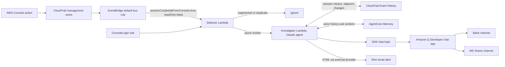
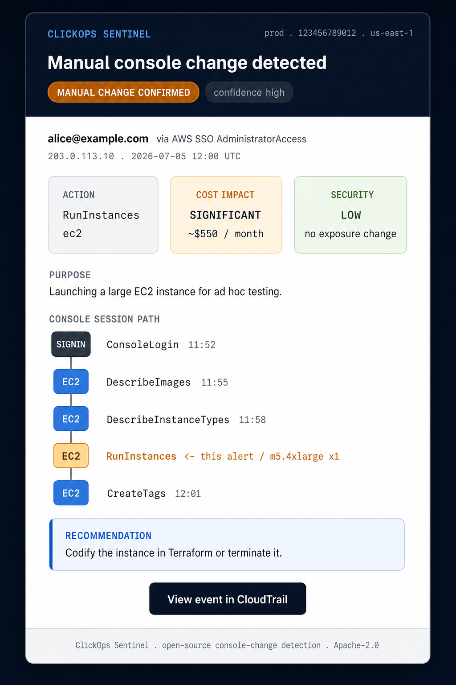

# ClickOps Sentinel

[](https://github.com/zoph-io/clickops-notifier/actions/workflows/ci.yml)
[](LICENSE)
[](https://www.python.org/)

Get notified, with AI-powered context, when someone changes your AWS account
through the AWS Console instead of infrastructure as code.

ClickOps Sentinel detects mutating actions made with console session
credentials in near real time, investigates each one with a Claude agent on
Amazon Bedrock (what was the user trying to do, what does it mean for
security and cost, what happened in the rest of the session), and delivers a
reasoned alert to Slack, Microsoft Teams, or a rich HTML email with a visual
step-by-step view of the console session.

## How it works



Detection relies on the CloudTrail `sessionCredentialFromConsole` flag, which
AWS sets server-side for every API call made with console session
credentials. There is no user-agent guessing, no CloudTrail trail to create,
and no S3 log parsing: management write events arrive on the EventBridge
default bus at no cost, in seconds.

Each detection is investigated by a Claude agent before you are notified.
The agent retraces the whole console session through CloudTrail LookupEvents
(one temporary access key equals one session), checks adjacent activity from
the same IP, consults its long-term memory about the actor, and produces:

- a verdict (`manual-change-confirmed`, `likely-sanctioned-activity`,
  `suspicious`) with confidence
- a purpose assessment: what the user was apparently trying to accomplish
- security implications with a severity rating: privilege escalation, public
  exposure, weakened defenses, secrets handling
- FinOps implications with a cost impact rating and rough monthly dollar
  range: instance launches, provisioned capacity, perpetual-billing
  resources, and also savings
- a session narrative and history context ("third manual security group
  change this month")
- a recommendation: import into IaC, revert, ask the user, or ignore

Delivery is guaranteed: if Bedrock is unavailable or the daily token budget
is spent, the alert still goes out on a plain, non-AI path.

## Rich email alerts

Email alerts are full HTML: verdict and confidence pills, security and cost
cards, the agent's purpose and recommendation, and a console session path
diagram showing every step the user took, with the alerted action
highlighted.



Emails are sent through an external transactional email provider, not
Amazon SES (SES production access is deliberately out of scope). Supported
providers: [Resend](https://resend.com) (default),
[Postmark](https://postmarkapp.com), [Mailgun](https://www.mailgun.com),
[SendGrid](https://sendgrid.com), or any SMTP server for a fully
self-hosted path. The transport uses the Python standard library only.

One-time provider setup (Resend example):

1. Create a Resend account, verify your sending domain, and create an API
   key.
2. Store the key as an SSM SecureString in the deployment region:

```bash
aws ssm put-parameter \
  --name /clickops-sentinel/email-api-key \
  --type SecureString \
  --value "re_your_api_key"
```

3. Deploy with `NotificationEmail` (recipient) and `EmailFrom` (verified
   sender). The key is fetched with decryption at runtime and never appears
   in CloudFormation outputs or Lambda environment variables.

For SMTP, set `EmailProvider=smtp` plus `EmailSmtpHost`, `EmailSmtpPort`,
and `EmailSmtpUsername`, and store the SMTP password in the SSM parameter.
For Mailgun, also set `EmailMailgunDomain`.

Preview the templates locally without any AWS access:

```bash
make preview-email   # writes docs/email-preview.html
```

## Prerequisites

- An AWS account with the AWS SAM CLI, Python 3.13, and GNU make installed
  locally.
- Bedrock model access: enable Anthropic Claude Sonnet 4.6 (or your chosen
  model) in the Bedrock console, in the region you deploy to. Current
  Anthropic models are invoked through cross-region inference profiles; the
  template composes the profile ID from `BedrockGeoPrefix` and
  `ClaudeModelId`.
- Amazon Bedrock AgentCore Memory availability in your region (used for
  long-term investigation memory; the stack deploys it via CloudFormation).
- For email delivery: an account at a supported email provider and the API
  key stored in SSM (see above).
- For Slack or Microsoft Teams delivery: a one-time workspace authorization
  in the Amazon Q Developer console (see below). Not needed for email.

## Quickstart (email)

```bash
git clone https://github.com/zoph-io/clickops-notifier.git
cd clickops-notifier
aws ssm put-parameter --name /clickops-sentinel/email-api-key \
  --type SecureString --value "re_your_api_key"
make install
make build
make deploy-guided
```

When prompted, set `NotificationEmail` to the recipient address and
`EmailFrom` to your verified sender, and accept the defaults elsewhere.

Smoke test: open the AWS Console and make a harmless change in the deployed
region, for example add a tag to an SNS topic. Within a minute or two you
should receive a rich HTML email leading with the agent's verdict and the
session path.

## Slack and Microsoft Teams setup

Chat delivery uses Amazon Q Developer in chat applications (formerly AWS
Chatbot). It renders the notifications natively and requires no webhook
management.

One-time workspace authorization (console, cannot be automated):

1. Open the Amazon Q Developer console, https://console.aws.amazon.com/chatbot/
2. Choose your chat client (Slack or Microsoft Teams) and authorize the
   workspace or tenant. For Slack, note the workspace ID; for Teams, note the
   team ID, channel ID, and tenant ID.
3. Invite the Amazon Q Developer app to the target channel.

Then redeploy with the IDs:

```bash
sam deploy --parameter-overrides \
  SlackWorkspaceId=T0123456789 SlackChannelId=C0123456789
```

or for Teams:

```bash
sam deploy --parameter-overrides \
  TeamsTeamId=... TeamsChannelId=... TeamsTenantId=...
```

Changes made by one console session are grouped into the same message thread.

## Configuration

| Parameter | Default | Description |
| --- | --- | --- |
| `NotificationEmail` | empty | Recipient address for email alerts. Empty disables email. |
| `EmailFrom` | empty | Verified sender address at your provider. Required for email. |
| `EmailProvider` | `resend` | `resend`, `postmark`, `mailgun`, `sendgrid`, or `smtp`. |
| `EmailApiKeyParam` | `/clickops-sentinel/email-api-key` | SSM SecureString parameter holding the provider API key or SMTP password. |
| `EmailSmtpHost` / `EmailSmtpPort` / `EmailSmtpUsername` | empty / `587` / empty | SMTP settings, only for `EmailProvider=smtp`. |
| `EmailMailgunDomain` | empty | Mailgun sending domain, only for `EmailProvider=mailgun`. |
| `SlackWorkspaceId` / `SlackChannelId` | empty | Slack channel via Amazon Q Developer. |
| `TeamsTeamId` / `TeamsChannelId` / `TeamsTenantId` | empty | Microsoft Teams channel via Amazon Q Developer. |
| `EnableConsoleLoginAlerts` | `true` | Alert on root sign-ins, sign-ins without MFA, failed sign-ins. |
| `EnableAIInvestigation` | `true` | Investigate detections with the Claude agent. `false` restores a plain notifier. |
| `ClaudeModelId` | `anthropic.claude-sonnet-4-6` | Bedrock model. Low-cost alternative: `anthropic.claude-haiku-4-5-20251001-v1:0`. |
| `BedrockGeoPrefix` | `us` | Inference profile geography: `us`, `eu`, `au`, `jp`, `global`. |
| `InvestigationLookbackHours` | `6` | Window for session retrace and same-IP correlation. |
| `DailyTokenBudget` | `2000000` | Hard daily cap on Bedrock tokens per UTC day. |
| `MaxAgentTurns` | `8` | Agent loop iterations per investigation. |
| `MemoryRetentionDays` | `180` | Retention for AgentCore Memory and investigation records. |
| `ExtraSuppressedActions` | empty | Comma-separated `service:Action` additions to the suppression list. |
| `AccountFriendlyName` | empty | Account name in alerts. Empty resolves the IAM account alias. |
| `LambdaMemorySize` | `128` | Detector Lambda memory. |
| `PermissionsBoundaryArn` | empty | Permissions boundary applied to all created IAM roles. |

## Cost guardrails

Bedrock consumption is bounded by five layers, so a burst of console
activity cannot run up the bill:

1. Every model call caps `maxTokens`, and tool outputs are truncated before
   they enter the context.
2. Each investigation is limited to `MaxAgentTurns` iterations and roughly
   60k combined tokens; near the ceiling the agent must conclude with the
   evidence it has.
3. A DynamoDB atomic counter enforces `DailyTokenBudget` per UTC day. When
   spent, investigations stop and alerts continue on the plain path, with a
   one-time notice in the channel.
4. One investigation per console session per 30 minutes: follow-up changes
   in the same session are appended to the same chat thread as one-line
   notes.
5. Token usage is published as CloudWatch metrics (`ClickOpsSentinel`
   namespace), with an alarm at 80 percent of the daily budget. Consider an
   AWS Budgets alert on the Bedrock service as a backstop.

At typical volumes (a handful of investigations per day, Sonnet 4.6, a few
thousand tokens each), expect well under one dollar per day. Switch
`ClaudeModelId` to Haiku 4.5 to cut per-investigation cost further. Email
volume at these rates fits within the free tier of every supported provider.

## Statistics

Every investigation writes a structured record (actor, action, verdict,
purpose, security severity, cost impact, tokens) to DynamoDB, retained for
`MemoryRetentionDays`. This is also a reviewable audit record of break-glass
console activity that can later be codified in IaC or reverted.

```bash
make stats DAYS=30
```

prints investigation counts, top actors, verdict and severity breakdowns,
cost impact distribution, and total token spend.

## Detection scope and trade-offs

What is covered: every mutating CloudTrail management event made with
console session credentials, in the deployed region, in near real time.
Because detection keys on a server-set credential flag, spoofed user agents
and new console user-agent variants cannot evade it, and role switching
inside the console remains detected.

Know the limits:

- Manual CLI and SDK actions are out of scope by design. A user running
  `aws ec2 run-instances` from a laptop is manual too, but carries no
  console flag. Catching that class requires federation conventions
  (session names set to emails) outside this tool's scope.
- Data events (S3 object uploads, Lambda console test invokes, DynamoDB
  item edits) never reach the EventBridge default bus and are not detected.
- Read-only console browsing is not alerted on.
- Regional scope: management events arrive on the default bus of the region
  where the call happened. Deploy the stack to each region you use. Deploy
  to us-east-1 at minimum, since global services (IAM, CloudFront, Route 53)
  log there:

```bash
make deploy REGION=us-east-1
make deploy REGION=eu-west-1
```

- AWS CloudShell inherits console session credentials, so CloudShell CLI
  activity is flagged and alerted, which is usually what you want.
- No historical replay: without a trail, an event missed during an outage of
  the detector is not reprocessed (the 90-day CloudTrail Event History
  remains available for manual review; the DLQ captures failed deliveries).

Compared to CloudTrail-S3-parsing tools (for example the
cloudandthings/terraform-aws-clickops-notifier Terraform module), this
design needs no trail, no log bucket access, no cross-account KMS decrypt
permissions, and reacts in seconds instead of minutes, at the price of the
regional deployment model above.

## Architecture notes

- The agent is a deliberately small loop on the Bedrock Converse API (see
  `src/investigator/agent_loop.py`): no framework, exact token accounting,
  boto3 as the only dependency. If investigations ever need to exceed the 15
  minute Lambda limit, Amazon Bedrock AgentCore Runtime is the natural
  migration path.
- AgentCore Memory stores each investigation as a conversational event; the
  built-in semantic and summary strategies extract long-term records per
  actor, which the agent queries through its `get_actor_memory` tool.
- Deduplication (EventBridge is at-least-once), session cooldowns, the daily
  token budget, and investigation records share one pay-per-request DynamoDB
  table.
- Email is sent directly by the Lambdas through the external provider's
  HTTPS API (or SMTP), using only the Python standard library. Email
  failures are logged and never block the chat notification. The provider
  API key lives in an SSM SecureString parameter, fetched with decryption at
  runtime and cached per execution environment.
- Renaming note: this repository was previously published as
  `clickops-notifier`. The stack name, metrics namespace, and AgentCore
  Memory resource name changed with the rename; redeploying over an old
  stack replaces the memory store, which rebuilds over time.

## Troubleshooting

- No alerts arrive: check the detector Lambda logs (structured JSON, one
  decision line per event: `skipped`, `suppressed`, `deduplicated`,
  `investigating`, `notified`). Confirm you acted in the deployed region.
- Alerts arrive without AI sections: check the investigator Lambda logs.
  Common causes: Bedrock model access not enabled for the inference profile,
  daily token budget exhausted, or AgentCore Memory unavailable in the
  region (memory degrades gracefully, Bedrock access does not).
- No email arrives: check the Lambda logs for `email delivery failed`.
  Common causes: SSM parameter missing in the deployment region, sender
  domain not verified at the provider, or `EmailFrom` not set (email is
  only enabled when both `NotificationEmail` and `EmailFrom` are set).
- Slack or Teams silent: verify the workspace authorization in the Amazon Q
  Developer console and that the app is invited to the channel. Test by
  publishing a custom notification JSON to the chat topic from the SNS
  console.
- Noisy action you want silenced: add `service:ActionName` to
  `ExtraSuppressedActions`, and consider opening an issue so it can join the
  default list.

## Development

```bash
make install        # venv plus dev dependencies
make lint           # ruff
make test           # pytest, no AWS credentials required
make validate       # sam validate --lint
make preview-email  # render the email templates to docs/email-preview.html
```

CI runs lint, tests, template validation, and a pip-audit dependency scan,
all credential-free. See [CONTRIBUTING.md](CONTRIBUTING.md) for guidelines,
[SECURITY.md](SECURITY.md) for vulnerability reporting, and
[CODE_OF_CONDUCT.md](CODE_OF_CONDUCT.md) for community standards.

## Future work

- Organization-wide deployment (org trail, StackSets, delegated admin).
- Session-name bypass detection for federated CLI access.
- Customizable message templates.
- Firehose or S3 sink for long-term alert archiving.

## License

Apache License 2.0. See [LICENSE](LICENSE).
